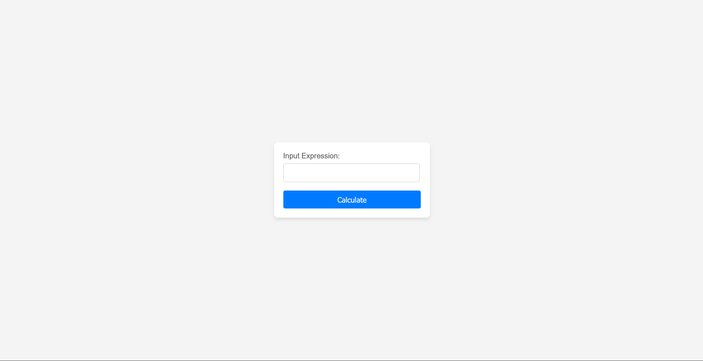

# Распределённый вычислитель арифметических выражений

## Описание

Этот проект является финальным заданием 2 спринта на курсе **"Программирование на Go"** от Яндекс Лицея. Он представляет из себя веб-сервис для вычисления математических выражений, который состоит из двух микросервисов:

- **Сервер (оркестратор)**, который получает выражение и разбивает его на задачи
- **Демон**, который запускает **_вычислители (агенты)_**, а **_агент_** в свою очередь постоянно отправляет http-запросы на **_сервер_**, чтобы получить задачу, вычисляет её и отправляет результат на сервер так же через http-запрос

## Техническое задание

  <details> 
  <summary>тык</summary>
  </details>

## Запуск проекта

0. Прежде чем устанавливать проект убедитесь, что у вас установлен **golang**. Если нет, то скачайте его перейдя по <a href="https://go.dev/dl/">ссылке</a>.<br>Также вам понадобится Git. Скачать его можно по этой <a href="https://git-scm.com/downloads">ссылке</a>
1. Клонируйте данный репозиторий GitHub себе на компьютер:
   ```git
    git clone https://github.com/DimaKropachev/calculate-web-server
   ```
2. Откройте два терминала и в каждом перейдите в папку проекта:
   ```
   cd calculate-web-server
   ```
3. Установите отсутствующие зависимости:
    ```
    go mod tidy
    ```
4. В одном терминале сначала запустите сервер:

   ```
   go run server/cmd/server/main.go
   ```

   В другом терминале запустите **демона**:

   ```
   go run demon/cmd/demon/main.go
   ```

   **ВАЖНО!**
   Сначала нужно запустить **сервер**, а потом уже **демона**. Если сначала запустить **демона**, то в консоль будет приходить лог с ошибкой о невозможности соединения, пока вы не запустите **сервер**

5. После того, как вы успешно выполнили все предыдущие шаги, *поздравляю* вы запустили сервис. Для отправки первого выражения перейдите по этой ссылке: http://localhost:8081/api/v1/input

## Как всё работает

- **Сервер**

  Сервер получает выражение из http-запроса, загружает его в хранилище и записывает в канал ***id*** данного выражения. 

  Далее оркестратор получает ***id*** выражения, и сначала проверяет правильность написания, пришедшего выражения, а затем разбивает его на задачи.

  Пример разбиения выражения `2*3-3*3/3*12-4+3` на задачи:

  ```
  +------+------+------+------+------+------+
  |  id  | arg1 | arg2 |  t1  |  t2  | oper |
  +------+------+------+------+------+------+
  |1.1.2 |2     |3     |      |      |  *   |
  +------+------+------+------+------+------+
  |1.2.2 |3     |3     |      |      |  *   |
  +------+------+------+------+------+------+
  |1.2.3 |      |3     |1.2.2 |      |  /   |
  +------+------+------+------+------+------+
  |1.2.4 |      |12    |1.2.3 |      |  *   |
  +------+------+------+------+------+------+
  |1.5.2 |      |      |1.1.2 |1.2.4 |  -   |
  +------+------+------+------+------+------+
  |1.5.3 |      |4     |1.5.2 |      |  -   |
  +------+------+------+------+------+------+
  |1.5.4 |      |3     |1.5.3 |      |  +   |
  +------+------+------+------+------+------+
  ```
  **id** - уникальный идентификатор задачи<br>
  **arg1** - 1 аргумент<br>
  **arg2** - 2 аргумент<br>
  **t1** - **id** задачи, результат которых будет использоваться как 1 аргумент<br>
  **t2** - **id** задачи, результат которых будет использоваться как 2 аргумент<br>
  **oper** - знак математической операции

  Далее эти задачи записываются в канал из которого функция `HandleTask` их получает и преобразует в задачи которые можно отправлять ***демону*** и записывает их в очередь, из которой ***демон*** берёт их и отдает ***агентам*** на вычисление. Результаты, вычислений ***агентов*** записывается в мапу вида: `map[task_id]result`.
- **Демон**
  После запуска **демон** запускает определенное количество ***агентов*** указанное в переменной окружения `COMPUTING_POWER`. Затем **демон** запупскает 2 горутины: одна каждую секунду секунду просит задачу, а вторая отправляет результаты задач.<br>
  **Агент** может получить задачу и время на ее выполнение. В случае если время истекло а задача не была выполнена, то в качестве ответа на эту задачу **демон** отправляет ошибку: `timeout`. 

## Выражения

Данный калькулятор может считать только математические выражения содержащие цифры и следующие знаки математических операций: `+`, `-`, `*`, `/`. Калькулятор пока не поддерживает выражений со скобками и числа с унарным минусом

## Примеры выражений

|пример|результат|ошибка|
|:-----|:--------|:-----|
|`2+2*2`|6|-|
|`2*3-3*3/3*12-4+3`|-31|-|
|`-2+33*/4`|-|`invalid expression`|
|`2-(3*3)+3`|-|`calculator is too stupid for that`|

В последнем примере присутствуют скобки, поэтому калькулятор отказывается это считать 

## Логирование
 
В данном проекте реализовано логирование с помощью [zap](https://pkg.go.dev/go.uber.org/zap). Все логи записываются в формате **JSON** в `stdout`

## Веб-интерфейс

Веб-интерфейс состоит из 5 страниц:
  - `http://localhost:8081/api/v1/input` - страница для ввода выражения
  
  - `http://localhost:8081/api/v1/expressions` - страница для получения информации о всех выражениях
  
  - `http://localhost:8081/api/v1/find` - страница для поиска выражения по **id**
  
  - `http://localhost:8081/api/v1/expressions/{:id}` - страница для получения информации выражения по **id**
  
  - `http://localhost:8081/api/v1/calculate` - страница для отображения **id**, который был присвоен выражению
  

## Схемы

  
  


## Как связаться

### [telegram](https://t.me/SKY_WaIker)